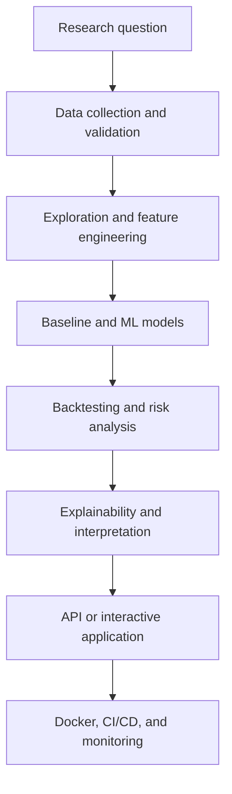

# AI and Machine Learning for Quantitative Research

[](https://github.com/lamsofttech/ai-ml-quantitative-research-portfolio/actions/workflows/ci.yml)
[](https://github.com/lamsofttech/ai-ml-quantitative-research-portfolio/actions/workflows/security.yml)
[](LICENSE)

**Building intelligent, reproducible systems for quantitative modeling, financial analysis, forecasting, and risk management.**

I am pursuing an M.S. in Quantitative Methods with a concentration in Mathematical Finance, and my career goal is to become an AI Engineer in Quantitative Research. This portfolio presents reproducible projects combining machine learning, statistics, mathematical modeling, financial analysis, and production software engineering. Each project progresses from a clearly defined research question to tested code, documented results, containerized execution, and automated CI/CD.

> An employer-facing portfolio of AI, machine learning, and software-engineering projects for quantitative research, mathematical finance, forecasting, optimization, and financial risk analysis.

## Research-to-production lifecycle



Every project reports research results, predictive performance, financial or business interpretation, engineering implementation, limitations, leakage and overfitting risks, and whether its evidence uses simulated or real data. A research model is never described as a profitable trading strategy without appropriate out-of-sample evidence, costs, and risk analysis.

## Project roadmap

| Project | Focus | Delivery target | Status |
|---|---|---|---|
| [Numerical Methods for Quantitative Research](projects/01-numerical-methods/) | Lagrange interpolation, error, stability, Python and R | Tested research package | Implemented foundation |
| [Monte Carlo Option Pricing and Risk Analysis](projects/02-monte-carlo-option-pricing/) | GBM, Black–Scholes, confidence intervals, VaR | Dockerized Streamlit app | Planned |
| [Financial Time-Series Forecasting](projects/03-financial-time-series/) | Baselines, walk-forward validation, leakage control | Explainable forecasting pipeline | Planned |
| [Machine Learning for Credit-Risk Prediction](projects/04-credit-risk-ml/) | Calibration, imbalance, fairness, explainability | FastAPI service | Planned |
| [Financial News and SEC Filing Analysis](projects/05-financial-nlp/) | Sentiment, topics, transformers | Hugging Face Gradio app | Planned |

The machine-readable catalog is in [`projects.yml`](projects.yml).

## Engineering principles

- Separate project environments: dependencies live with the project that needs them.
- Reproducible experiments: fixed seeds, explicit data provenance, configuration, and versioned results.
- Time-aware evaluation: temporal splits and walk-forward testing for financial series.
- Honest evidence: baselines, uncertainty, transaction costs where relevant, and documented failure modes.
- Production quality: type hints, automated tests, linting, dependency review, secret scanning, containers, and deployable interfaces.
- Responsible AI: explainability, fairness, model-risk controls, and appropriate human oversight.

## Quick start

```bash
git clone https://github.com/lamsofttech/ai-ml-quantitative-research-portfolio.git
cd ai-ml-quantitative-research-portfolio
python -m venv .venv
source .venv/bin/activate  # Windows PowerShell: .venv\Scripts\Activate.ps1
python -m pip install -e "projects/01-numerical-methods[dev]"
pytest projects/01-numerical-methods/tests
```

Run the interpolation demonstration:

```bash
python projects/01-numerical-methods/examples.py
Rscript projects/01-numerical-methods/r/lagrange_interpolation.R
```

## Repository map

```text
portfolio/                    Portfolio metadata and profile
projects/                     Independent quantitative research projects
docs/                         Standards shared by all projects
scripts/                      Repository validation utilities
.github/workflows/            CI, security, and container automation
projects.yml                  Project catalog used by the portfolio
```

## Important disclaimer

This repository is for education and research. It is not investment advice. Simulated or historical performance does not guarantee future results.

## Author

Lameck Nyakweba — M.S. Quantitative Methods, Mathematical Finance concentration; aspiring AI Engineer in Quantitative Research.
